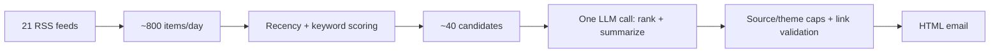

# news-digest

A daily news digest built for one reader's specific coverage area.

Financial news relevant to a particular role — a specific desk, a specific
set of peer firms, a specific slice of macro data — is scattered across
dozens of sources, and generic aggregators have no way to know what
"relevant" means for any one person. This pipeline fetches from ~20
sources, filters and ranks with an LLM against a profile of what the
reader actually cares about, and emails a short digest once a day.

## Sample output

Real output from a live run (`python main.py --dry-run`), employer
reference genericized:

```
[Rates & Derivatives] US mutual funds flip to paying fixed in swaps for first time since 2021
Risk.net's Counterparty Radar data shows US mutual funds have reversed a four-year trend, moving from net receivers to net payers of fixed rates in interest-rate swaps. The shift implies real-money accounts are repositioning duration exposure as rate expectations evolve.
Why it matters: A direct read on how real-money swap positioning is shifting -- useful context for the reader's own balance-sheet rate hedging and swap curve exposure.
Source: Risk.net -> https://www.risk.net/markets/7963907/us-funds-become-fixed-rate-payers-in-swap-market

[Alt Managers & Deals] GCM Grosvenor closes $1.2bn credit secondaries fund, above target
GCM Grosvenor closed a North America-focused private credit secondaries fund at $1.2 billion, exceeding its original $886 million target. The raise underscores continued investor appetite for secondary liquidity solutions in private credit.
Why it matters: Tracks fundraising momentum among alt-manager peers, useful competitive intelligence for the reader's own credit and asset-allocation strategy.
Source: Private Debt Investor -> https://www.privatedebtinvestor.com/gcm-grosvenor-closes-credit-secondaries-fund-on-1-2bn/
```

## How it works



- **21 feeds**, curl-verified, chosen for one reader's lane, not general news.
- **Keyword taxonomy generated from a profile** (`keyword_gen.py`) -- a
  reader fills in who they are (name, role, company, industry, topics to
  avoid) in the web UI; one Claude call turns that into the weighted
  keyword list `filter.py` scores against. Regenerated only when one of
  those identity fields actually changes.
- **Recency + keyword scoring** (`filter.py`) -- cheap deterministic pass
  that drops stale items and ranks the rest, shrinking ~800 items/day to a
  pool small enough for one LLM call.
- **One LLM call** (`digest.py`) -- Claude ranks the pool, clusters
  near-duplicate coverage of the same story, and writes an original
  headline/summary/why-it-matters for each item it selects.
- **Source/theme caps + link validation** -- deterministic Python
  post-processing that enforces diversity limits and rejects any link
  not matching a real fetched candidate, regardless of the model's output.
- **HTML email** (`send.py`) -- Jinja2 template, sent via Resend.

## Design notes

**The keyword filter is a pre-filter, not the selector.** It's cheap and
mechanical, and can't judge redundancy or nuance, so it deliberately keeps
everything scoring above zero rather than narrowing tightly. Editorial
judgment happens in the one LLM call downstream -- the only part of the
pipeline actually capable of it.

**Keyword weights are generated, not hand-authored.** Early versions had a
UI for manually adding keywords and tuning numeric weights per tier --
workable, but it asked the reader to think like the filter instead of just
describing themselves. `keyword_gen.py` now takes the structured profile
(role, company, industry, topics to avoid) and asks Claude for the
keyword/weight list directly. `filter.py` is unchanged; only where the
dict it scores against comes from is different.

**Source/theme diversity caps are enforced in Python, not the prompt.**
Asking the model to self-limit worked most of the time and then silently
didn't -- one run put 3 of 8 items from the same source despite an
explicit instruction against it. The caps are now a deterministic pass
over the model's ranked output, so the invariant holds regardless of what
comes back.

**Every link is checked against the actual fetched candidate set.** The
model works from titles and summaries, not the live page, so it can
misattribute or invent a URL. A wrong link in a daily email erodes trust
in everything else the tool does, so any mismatched link is rejected and
the model is asked to retry against the specific problem.

**No orchestration framework.** The pipeline is a straight line -- fetch,
filter, curate, send -- with no branching, no agent loop, no tool-calling
state. A framework would add abstraction over a problem this doesn't
have. It's four plain modules calling each other in sequence, runnable
individually or end to end via `main.py`.

## Problems solved

**Timezone bug in recency filtering.** Symptom: item ages computed
slightly wrong. Diagnosis: `time.mktime()` treats its input as local time,
but feedparser's parsed struct is already UTC -- silently shifting every
timestamp by the host's UTC offset. Fix: `calendar.timegm()`, which
treats the struct as UTC correctly.

**Recall collapse from over-scoped keywords.** Symptom: the candidate
pool nearly emptied after a first fix for false-positive keyword matches
(substring matching turned `"repo"` into a match inside `"report"`)
converted single words into multi-word phrases. That overcorrected. Fix:
regex word-boundary matching, so keywords stayed precise single words
with no collision risk.

**Feed dropped after a link-integrity check.** Symptom: emailed headlines
that didn't describe their linked article. Diagnosis: live inspection
showed the source's title/summary were consistent with each other but the
link pointed to an unrelated article -- undetectable from feed data alone.
Fix: dropped the feed; every item's link was now suspect, not just the ones caught.

**Token budget truncation.** Symptom: the digest call failed validation
on both retry attempts. Diagnosis: the model's extended thinking (on by
default) consumed the entire token budget before writing any output. Fix:
raised the budget and switched to a streaming call, also the correct way
to make a request this size.

## Stack

Python, feedparser, Anthropic API (Claude Sonnet), Jinja2, Resend, cron.

## Setup

```bash
python3 -m venv .venv
source .venv/bin/activate
pip install -r requirements.txt

cp .env.example .env                     # fill in API keys + contact email
cp profiles.example.json profiles.json   # then edit profiles.json with your own reader profile
```

`profiles.json` is gitignored -- it holds who you are and what you care
about (recipient, keyword weights, feeds), so it never ends up committed.
`config.py` holds everything not sensitive or per-reader.

```bash
python main.py              # fetch -> filter -> curate -> send, for the first profile in profiles.json
python main.py --dry-run    # same, but prints instead of sending
python main.py --profile id # run a specific profile (by its "id" in profiles.json)
python main.py --to a@b.com # override the recipient for this run
```

Every run is logged to `run.log`. Each stage also runs standalone against
the first profile in `profiles.json`:

```bash
python fetch.py    # pull all feeds, print raw item counts
python filter.py   # fetch + keyword-filter, print what survives + near-misses
python digest.py   # fetch + filter + the Claude curation call, print the result
python send.py     # render the email template to _preview.html; optionally send a test email
```

### Running the API + web UI

There's also a local Flask API and a React frontend for editing profiles
and previewing digests in the browser instead of the CLI. Both need to be
running at the same time, in two separate terminals:

```bash
# terminal 1, from the project root
python app.py               # Flask API on http://localhost:5001

# terminal 2
cd frontend
npm install                 # first time only
npm run dev                 # Vite dev server on http://localhost:5173
```

Then open `http://localhost:5173`. If the page shows an API error, it
almost always means `python app.py` isn't running -- the frontend has no
fallback and no local storage, it's a live view onto the Flask API.

Flask runs on port 5001, not 5000 -- on macOS, port 5000 is claimed by the
AirPlay Receiver service by default and silently intercepts requests
before they reach Flask.

| File | Purpose |
|---|---|
| `profiles.json` | Reader profiles: recipient, keywords, feeds (gitignored -- copy from `profiles.example.json`) |
| `config.py` | Global settings not tied to any one profile |
| `profiles.py` | Loads/saves `profiles.json`, shapes a stored profile for the pipeline |
| `fetch.py` | Pulls every feed, normalizes entries |
| `filter.py` | Dedupes, drops stale items, scores by keyword relevance |
| `digest.py` | The Claude API call that curates and writes the final items |
| `send.py` | Renders the HTML email and sends via Resend |
| `main.py` | Orchestrates the whole pipeline, CLI entry point |
| `app.py` | Flask API wrapping the pipeline, for the frontend |
| `frontend/` | React UI: edit profiles, preview digests, view run history |
| `templates/digest.html` | The email template (Jinja2) |
